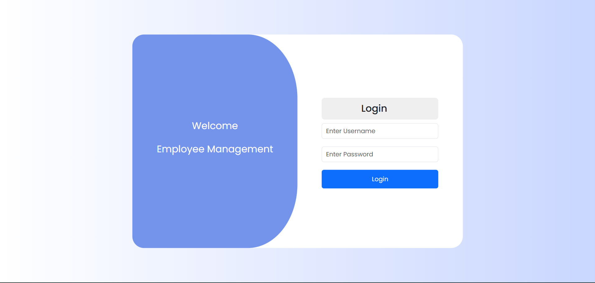
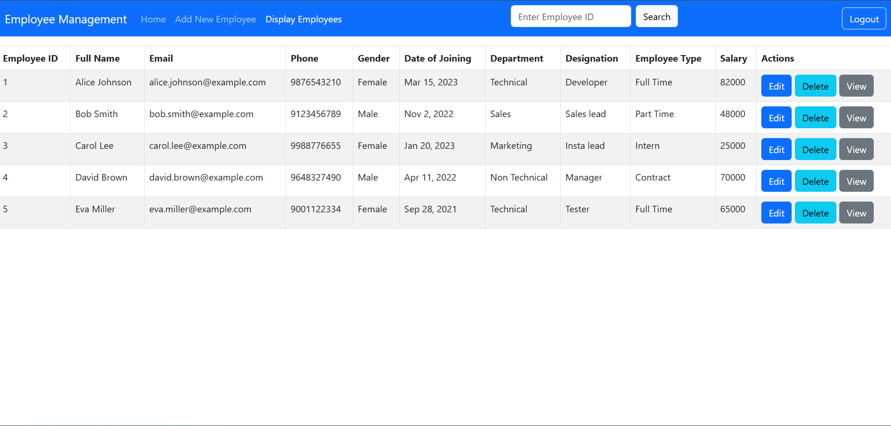
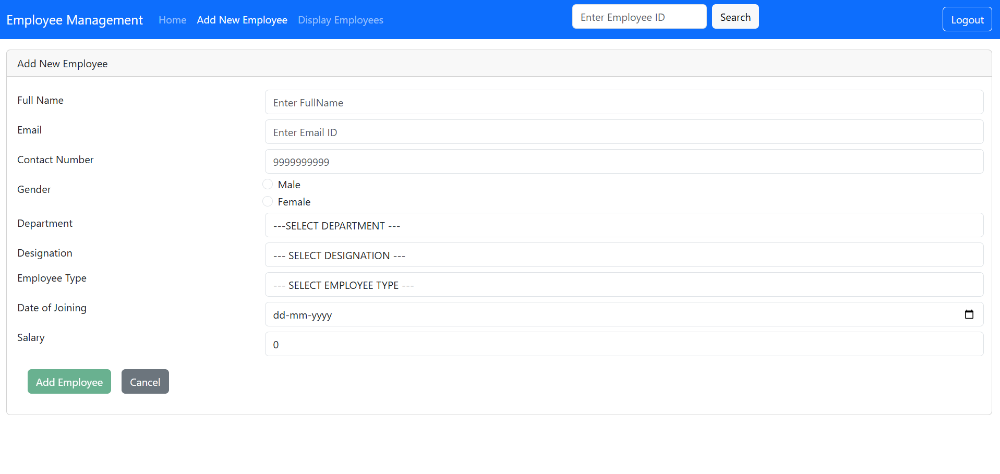
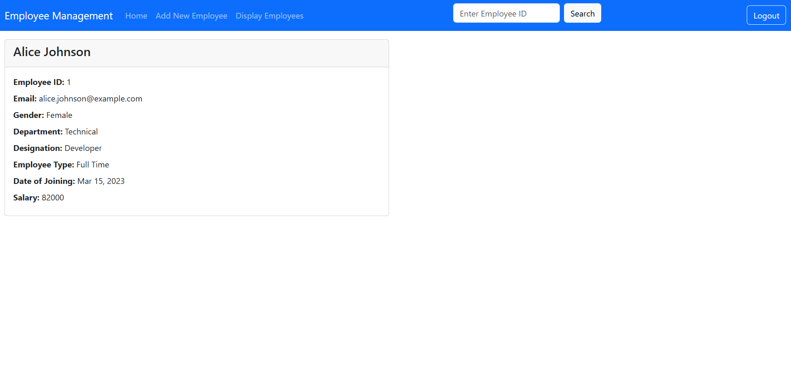

# Employee Management Application

**Live Demo:** [employee-management-application-two.vercel.app](https://employee-management-application-two.vercel.app)  

An Angular web application to manage employee data: create, view, edit, delete employees. Built using Angular, TypeScript, CSS, and deployed to Vercel.

---

## 🧰 Features

- Add new employees  
- View a list of employees  
- Edit existing employee details  
- Delete employees  
- Responsive UI layout  
- Uses Angular template driven forms, reactive forms  
- Client-side routing with route fallback (for deep links)  

---

## 📁 Project Structure

/Employee-Management-Application
├── src/
│ ├── app/
│ │ ├── pages/ # Views like dashboard, employee, employee detail, layout, login, new-employee, not-found etc.
│ │ ├── shared/ # Shared components like card
│ │ ├── services/ # Employee Service
│ │ ├── model/ # Employee Model
│ │ └── app.module.ts
│ ├── environments/
│ └── index.html
├── angular.json
├── package.json
├── tsconfig.json
├── vercel.json
└── README.md

## 🚀 Getting Started

### Prerequisites

- [Node.js](https://nodejs.org) (v16+ recommended)  
- Angular CLI installed globally:  
  ```bash
  npm install -g @angular/cli

## 🚀 Installation

### Clone the repo
- git clone https://github.com/banumathimuthumariappan-gif/Employee-Management-Application.git
- cd Employee-Management-Application

### Install dependencies
- npm install

## 🚀 Installation
- ng serve

- By default, the app is served at http://localhost:4200/. 
- It supports live reloading when you modify source files.

## Building for Production
- ng build

- The compiled output is placed in the dist/Employee-Management-Application/ folder by default (check your angular.json for the exact output path).

## Screenshots






## 📄 License & Credits

This project is open source. You are free to use, modify, and distribute it.

Made with ❤️ by Banumathi Muthumariappan